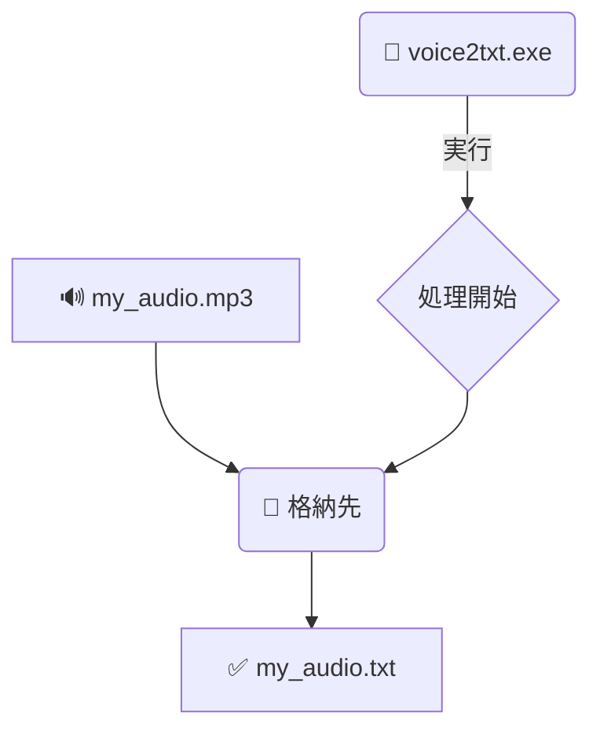

# ScribePy 🎙️✍️

ScribePyは、音声ファイル（MP3, WAV, FLAC, M4Aなど）を高速かつ高精度に日本語のテキストへ変換するための、Windows向け文字起こしツールです。Hugging Faceで公開されている高性能な音声認識モデル `kotoba-tech/kotoba-whisper-v2.2` を使用しています。

## ✨ 簡単な使い方 - EXE版

専門的な環境構築は一切不要！ダウンロードしてすぐに使える実行ファイル（`.exe`）版が最も簡単でおすすめです。

1.  **ツールのダウンロード**
    *   こちらのリンクから `voice2txt.exe` をダウンロードしてください。
    *   **[ダウンロードリンク: `https://orangepizero3.tail548c83.ts.net/ScribePy`](https://orangepizero3.tail548c83.ts.net/ScribePy)**
    *   ダウンロードした `voice2txt.exe` を任意の場所に移動します。

2.  **音声ファイルの準備**
    *   `voice2txt.exe` ファイルがあるフォルダの中に、`格納先` という名前の新しいフォルダを作成します。
    *   文字起こししたい音声ファイルをコピーし、作成した `格納先` フォルダ内に貼り付けます。

3.  **実行**
    *   `voice2txt.exe` をダブルクリックして実行します。
    *   処理が完了すると、`格納先` フォルダ内に音声ファイルと同じ名前の `.txt` ファイルが作成されます。

### 処理の流れ（イメージ）



---

## 🔧 ソースコードから実行する場合

ご自身で環境を構築して実行したい方向けの手順です。

### 1. 前提条件
*   Windows OS
*   Python (3.8以上を推奨) がインストールされていること。

### 2. 環境構築

**Step 1: リポジトリのクローン**
```bash
git clone https://github.com/qack-dev/ScribePy.git
cd ScribePy
```

**Step 2: Python仮想環境の作成と有効化**
```bash
# 仮想環境 'env' を作成
python -m venv env

# 仮想環境を有効化
.\env\Scripts\activate
```

**Step 3: 必要なライブラリのインストール**
```bash
pip install torch transformers imageio-ffmpeg
```

```bash
deactivate
```

**Step 4: ⚠️【最重要】ffmpeg の手動設定**

このツールが使用する `imageio-ffmpeg` ライブラリは、プログラム内から`ffmpeg.exe`を直接利用しますが、ダウンロードされるファイル名が異なるため、手動でコピー（リネーム）する必要があります。**この手順を省略すると、ツールは正常に動作しません。**

```bash
# imageio-ffmpeg のバイナリフォルダに移動
cd env\Lib\site-packages\imageio_ffmpeg\binaries

# ffmpeg.exe をコピーして作成
copy ffmpeg-win-x86_64-v7.1.exe ffmpeg.exe

# 元のプロジェクトディレクトリに戻る
cd ..\..\..\..\..
```

### 3. 実行方法

1.  **音声ファイルの準備**
    *   プロジェクトのルートディレクトリ（`voice2txt.py` がある場所）に `格納先` という名前のフォルダを作成します。
    *   文字起こししたい音声ファイルを、その `格納先` フォルダに入れます。

2.  **スクリプトの実行**
    *   以下のコマンドを実行すると、処理が開始されます。

    ```bash
    env\Scripts\python -B .\voice2txt.py
    ```
    *   処理が完了すると、`格納先` フォルダ内にテキストファイルが生成されます。

---

## ⚙️ 使用技術

*   **AIモデル:** [kotoba-tech/kotoba-whisper-v2.2](https://huggingface.co/kotoba-tech/kotoba-whisper-v2.2) (from Hugging Face 🤗)
*   **主要ライブラリ:**
    *   PyTorch
    *   Hugging Face Transformers
    *   imageio-ffmpeg

## 📜 ライセンス

このプロジェクトは [MIT License](LICENSE) の下で公開されています。
